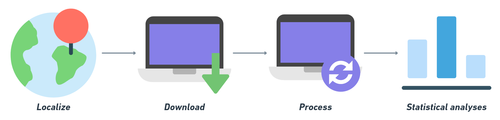

<style>
body {text-align: justify}
</style>

```{r knitr_init, echo=FALSE, message=FALSE, warning=FALSE, cache=FALSE}
library(knitr)
library(rmdformats)
library(kableExtra)
library(ggplot2)
library(leaflet)

load("results.RData")
```



L'objectif de l'exercice est de calculer le temps parcours et la distance à parcourir pour rejoindre l'arrêt de bus le plus proche et le plus éloigné dans un rayon de 2500 et 5000 mètres.

### ***Etapes***  
1 - Créer et spatialiser un point à Rouen  
2 - Télécharger les données OSM  

```{r eval=F, echo=T}
database <- osmdata::getbb("Rouen") %>% 
  osmdata::opq() %>% 
  osmdata::add_osm_feature(key = "public_transport", value = c("platform"))
```

3 - Traiter les données (zone tampon, distance, intersection)  
4 - Réaliser quelques statistiques (x2 pour une zone tampon de 2500 et 5000 mètres)  
    * Boîte à moustaches des distances entre le point et les stations de bus   
    * Courbe de distribution des ces mêmes distances  
    * Temps parcours pour rejoindre l'arrêt de bus le plus proche et le plus éloigné (minutes)  
    * Distance à parcourir parcours pour rejoindre l'arrêt de bus le plus proche et le plus éloigné (km)  
    
### ***Données (Inputs)***    
- *From scratch*  
- Librairies nécessaires  **sf**, **osrm**, **osmdata**, **dplyr**, **ggplot2**  

### ***Résultats (Outputs)***   
- 2 boîtes à moustaches  
- 2 courbes de distribution   
- 2 temps parcours (minutes)   
- 2 distances à parcourir (km)   
- Un diagramme de la chaîne de traitements    
- Un texte décrivant la chaîne de traitements et les statistiques      

`r emo::ji("warning")` Votre rendu doit faire deux pages maximum et est à déposer au plus tard le  `r emo::ji("date")` 17 décembre 2021 sur [Universitice](https://universitice.univ-rouen.fr)  

### ***Exemple***  

1 - Créer et spatialiser un point à Rouen  

```{r echo=FALSE, message=FALSE, warning=FALSE}
results$location
```

2 - Télécharger les données OSM

```{r echo=FALSE, message=FALSE, warning=FALSE}
results$bus
```

3 - Traiter les données (zone tampon, distance, intersection)  

```{r echo=FALSE, message=FALSE, warning=FALSE}
results$intersects
```

4 - 4 - Réaliser quelques statistiques (x2 pour une zone tampon de 2500 et 5000 mètres)  

```{r echo=FALSE, message=FALSE, warning=FALSE}
results$roads
```

```{r echo=FALSE, message=FALSE, warning=FALSE}
results$curveBoxplot.plot_distance
```

Les temps de parcours sont de 3 et 17 minutes à pied. Et les distances sont de 225 mètres et 1.3 kilomètres